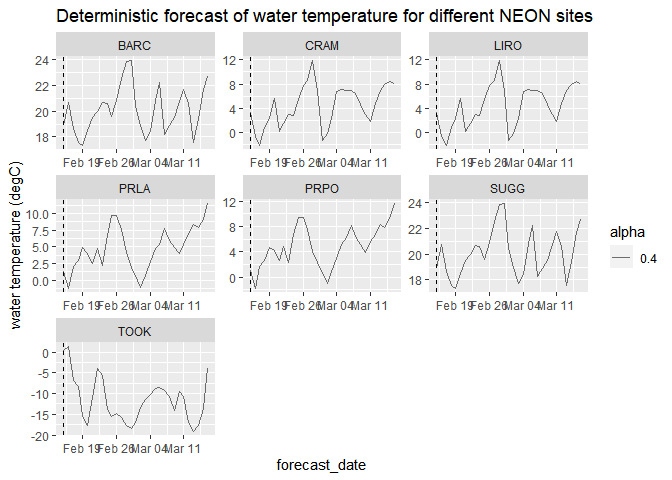
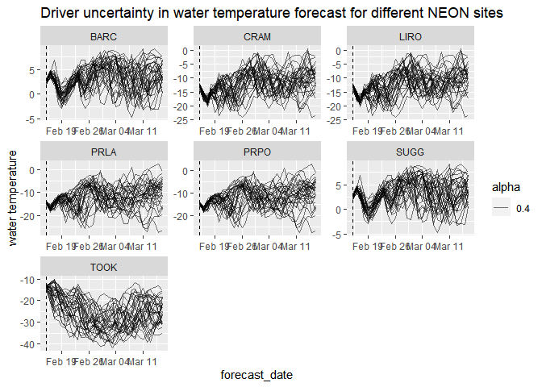
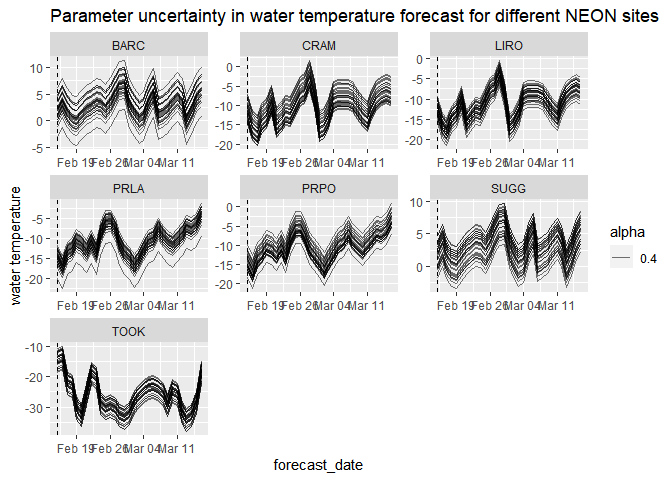
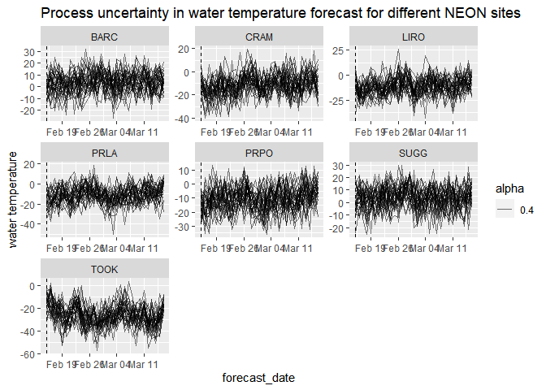
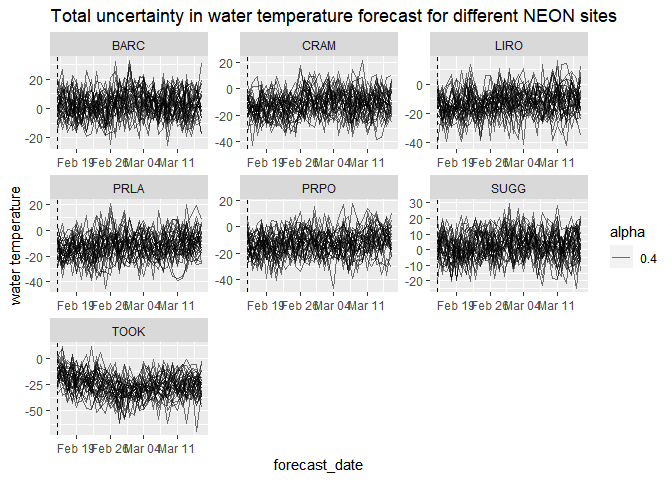
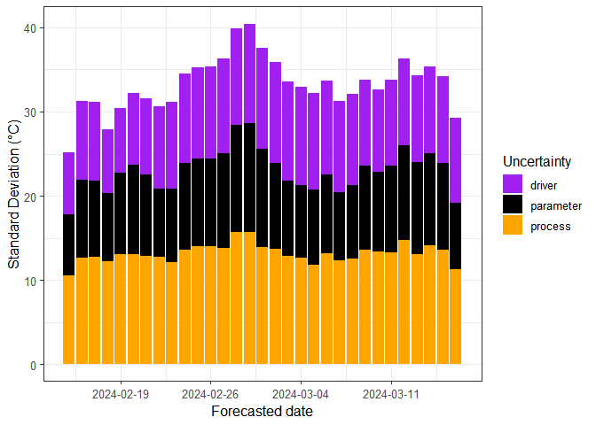

-   [1 This R markdown document](#this-r-markdown-document)
-   [2 Introduction to NEON forecast
    challenge](#introduction-to-neon-forecast-challenge)
    -   [2.1 Aquatics challenge](#aquatics-challenge)
    -   [2.2 Submission requirements](#submission-requirements)
-   [3 The forecasting workflow](#the-forecasting-workflow)
    -   [3.1 Read in the data](#read-in-the-data)
    -   [3.2 Visualise the data](#visualise-the-data)
-   [4 Introducing co-variates](#introducing-co-variates)
    -   [4.1 Download co-variates](#download-co-variates)
        -   [4.1.1 Download historic data](#download-historic-data)
        -   [4.1.2 Download future weather
            forecasts](#download-future-weather-forecasts)
-   [5 Model 1: Linear model with
    covariates](#model-1-linear-model-with-covariates)

# 1 This R markdown document

This document presents workshop materials to get you started on
generating forecasts specifically for submission to the EFI-NEON
Forecasting Challenge. The Challenge goal is to create a community of
practice that builds capacity for ecological forecasting by leveraging
NEON data products. The Challenge revolves around the five theme areas
that span aquatic and terrestrial systems, and population, community,
and ecosystem processes across a broad range of ecoregions that uses
data collected by NEON. Learn more about the Challenge
[here](https://projects.ecoforecast.org/neon4cast-docs/)!

The development of these materials has been supported by NSF grants
DEB-1926388 and DBI-1933016.

To complete the workshop via this markdown document the following
packages will need to be installed:

-   `remotes`
-   `fpp3`
-   `tsibble`
-   `tidyverse`
-   `lubridate`
-   `neon4cast` (from github)

The following code chunk should be run to install packages.

``` r
#install.packages('remotes')
#install.packages('fpp3') # package for applying simple forecasting methods
#install.packages('tsibble') # package for dealing with time series data sets and tsibble objects
#install.packages('tidyverse') # collection of R packages for data manipulation, analysis, and visualisation
#install.packages('lubridate') # working with dates and times
remotes::install_github('eco4cast/neon4cast') # package from NEON4cast challenge organisers to assist with forecast building and submission
```

Additionally, R version 4.2 is required to run the neon4cast package.
It’s also worth checking your Rtools is up to date and compatible with R
4.2, see
(<https://cran.r-project.org/bin/windows/Rtools/rtools42/rtools.html>).

``` r
version$version.string
```

    ## [1] "R version 4.3.2 (2023-10-31 ucrt)"

``` r
library(tidyverse)
```

    ## ── Attaching core tidyverse packages ──────────────────────── tidyverse 2.0.0 ──
    ## ✔ dplyr     1.1.2     ✔ readr     2.1.4
    ## ✔ forcats   1.0.0     ✔ stringr   1.5.0
    ## ✔ ggplot2   3.4.2     ✔ tibble    3.2.1
    ## ✔ lubridate 1.9.3     ✔ tidyr     1.3.0
    ## ✔ purrr     1.0.1     
    ## ── Conflicts ────────────────────────────────────────── tidyverse_conflicts() ──
    ## ✖ dplyr::filter() masks stats::filter()
    ## ✖ dplyr::lag()    masks stats::lag()
    ## ℹ Use the conflicted package (<http://conflicted.r-lib.org/>) to force all conflicts to become errors

``` r
library(lubridate)
```

If you do not wish to run the code yourself you can follow along via the
html (NEON_forecast_challenge_workshop.md), which can be downloaded from
the [Github
repository](https://github.com/OlssonF/NEON-forecast-challenge-workshop).

# 2 Introduction to NEON forecast challenge

The EFI RCN NEON Forecast Challenge asks the scientific community to
produce ecological forecasts of future conditions at NEON sites by
leveraging NEON’s open data products. The Challenge is split into five
themes that span aquatic and terrestrial systems, and population,
community, and ecosystem processes across a broad range of ecoregions.
We are excited to use this Challenge to learn more about the
predictability of ecological processes by forecasting NEON data before
it is collected.

Which modeling frameworks, mechanistic processes, and statistical
approaches best capture community, population, and ecosystem dynamics?
These questions are answerable by a community generating a diverse array
of forecasts. The Challenge is open to any individual or team from
anywhere around the world that wants to submit forecasts. Sign up
[here.](https://projects.ecoforecast.org/neon4cast-docs/Participation.html).

## 2.1 Aquatics challenge

What: Freshwater surface water temperature, oxygen, and chlorophyll-a.

Where: 7 lakes and 27 river/stream NEON sites.

When: Daily forecasts for at least 30-days in the future. New forecast
submissions, that use new data to update the forecast, are accepted
daily. The only requirement is that submissions are predictions of the
future at the time the forecast is submitted.

Today we will focus on lake sites only and will start with forecasting
water temperature. For the challenge, you can chose to submit to either
the lakes, rivers or streams or all three! You can also chose to submit
any of the three focal variables (temperature, oxygen, and chlorophyll).
Find more information about the aquatics challenge
[here](https://projects.ecoforecast.org/neon4cast-docs/Aquatics.html).

## 2.2 Submission requirements

For the Challange, forecasts must include quantified uncertainty. The
file can represent uncertainty using an ensemble forecast (multiple
realizations of future conditions) or a distribution forecast (with mean
and standard deviation), specified in the family and parameter columns
of the forecast file.

For an ensemble forecast, the `family` column uses the word `ensemble`
to designate that it is a ensemble forecast and the parameter column is
the ensemble member number (1, 2, 3 …). For a distribution forecast, the
`family` column uses the word `normal` to designate a normal
distribution and the parameter column must have the words mu and sigma
for each forecasted variable, site_id, and datetime. For forecasts that
don’t have a normal distribution we recommend using the ensemble format
and sampling from your non-normal distribution to generate a set of
ensemble members that represents your distribution. I will go through
examples of both `ensemble` and `normal` forecasts as examples.

The full list of required columns and format can be found in the
[Challenge
documentation](https://projects.ecoforecast.org/neon4cast-docs/Submission-Instructions.html).

# 3 The forecasting workflow

## 3.1 Read in the data

We start forecasting by first looking at the historic data - called the
‘targets’. These data are available near real-time, with the latency of
approximately 24-48 hrs. Here is how you read in the data from the
targets file available from the EFI server.

``` r
#read in the targets data
targets <- read_csv('https://data.ecoforecast.org/neon4cast-targets/aquatics/aquatics-targets.csv.gz')
```

Information on the NEON sites can be found in the
`NEON_Field_Site_Metadata_20220412.csv` file on GitHub. It can be
filtered to only include aquatic sites. This table has information about
the field sites, including location, ecoregion, information about the
watershed (e.g. elevation, mean annual precipitation and temperature),
and lake depth.

``` r
# read in the sites data
aquatic_sites <- read_csv("https://raw.githubusercontent.com/eco4cast/neon4cast-targets/main/NEON_Field_Site_Metadata_20220412.csv") |>
  dplyr::filter(aquatics == 1)
```

Let’s take a look at the targets data!

    ## # A tibble: 11 × 4
    ##    datetime   site_id variable    observation
    ##    <date>     <chr>   <chr>             <dbl>
    ##  1 2017-04-23 ARIK    temperature       12.7 
    ##  2 2017-04-24 ARIK    chla              NA   
    ##  3 2017-04-24 ARIK    oxygen             7.10
    ##  4 2017-04-24 ARIK    temperature       14.8 
    ##  5 2017-04-25 ARIK    chla              NA   
    ##  6 2017-04-25 ARIK    oxygen             6.58
    ##  7 2017-04-25 ARIK    temperature       15.5 
    ##  8 2017-04-26 ARIK    chla              NA   
    ##  9 2017-04-26 ARIK    oxygen             7.32
    ## 10 2017-04-26 ARIK    temperature       13.0 
    ## 11 2017-04-27 ARIK    chla              NA

The columns of the targets file show the time step (daily for aquatics
challenge), the 4 character site code (`site_id`), the variable being
measured, and the mean daily observation. To look at only the lakes we
can subset the targets and aquatic sites to those which have the
`field_site_subtype` of `Lake`.

``` r
lake_sites <- aquatic_sites %>%
  filter(field_site_subtype == 'Lake')

targets <- targets %>%
  filter(site_id %in% lake_sites$field_site_id)
```

## 3.2 Visualise the data


We can think about what type of models might be useful to predict these
variables at these sites. Below are descriptions of three simple models
which have been constructed to get you started forecasting:

-   We could use information about current conditions to predict the
    next day. What is happening today is usually a good predictor of
    what will happen tomorrow (Model 2 - Persistence).
-   We could also look at the lake variables’ relationship(s) with other
    variable. Could we use existing forecasts about the weather to
    generate forecasts about lake variables (Model 1 - Linear Model with
    Co-variates).
-   And we could think about what the historic data tells us about this
    time of year. January this year is likely to be similar to January
    last year (Model 3 - Climatology/Seasonal Naive Model)

To start, we will produce forecasts for just one of these target
variables, surface water temperature.

``` r
targets <- targets %>%
  filter(variable == 'temperature')
```

# 4 Introducing co-variates

One important step to overcome when thinking about generating forecasts
is to include co-variates in the model. A water temperature forecast,
for example, may be benefit from information about past and future
weather. The neon4cast challenge package includes functions for
downloading past and future NOAA weather forecasts for all of the NEON
sites. The 3 types of data are as follows:

-   stage_1: raw forecasts - 31 member ensemble forecasts at 3 hr
    intervals for the first 10 days, and 6 hr intervals for up to 35
    days at the NEON sites.
-   stage_2: a processed version of Stage 1 in which fluxes are
    standardized to per second rates, fluxes and states are interpolated
    to 1 hour intervals and variables are renamed to match conventions.
    We recommend this for obtaining future weather. Future weather
    forecasts include a 30-member ensemble of equally likely future
    weather conditions.
-   stage_3: can be viewed as the “historical” weather and is
    combination of day 1 weather forecasts (i.e., when the forecasts are
    most accurate).

This code create a connection to the dataset hosted on the eco4cast
server (`neon4cast-drivers/noaa/gefs-v12`) using `arrow` functions. To
download the data you have to tell the function to `collect()` it. These
data set can be subsetted and filtered using `dplyr` functions prior to
download to limit the memory usage.

You can read more about the NOAA forecasts available for the NEON sites
[here:](https://projects.ecoforecast.org/neon4cast-docs/Shared-Forecast-Drivers.html)

## 4.1 Download co-variates

### 4.1.1 Download historic data

We will generate a water temperature forecast using `air_temperature` as
a co-variate. Note: This code chunk can take a few minutes to execute as
it accesses the NOAA data.

``` r
# past stacked weather
noaa_past_s3 <- neon4cast::noaa_stage3()

variables <- c("air_temperature", "air_pressure")
#Other variable names can be found at https://projects.ecoforecast.org/neon4cast-docs/Shared-Forecast-Drivers.html#stage-3

noaa_past <- noaa_past_s3  |> 
  dplyr::filter(site_id %in% lake_sites$field_site_id,
                datetime >= ymd('2017-01-01'),
                variable %in% variables) |> 
  dplyr::collect()

noaa_past
```

    ## # A tibble: 12,905,858 × 7
    ##    parameter datetime            variable   prediction family reference_datetime
    ##        <dbl> <dttm>              <chr>           <dbl> <chr>  <lgl>             
    ##  1         0 2020-09-24 00:00:00 air_press…    101189. ensem… NA                
    ##  2         1 2020-09-24 00:00:00 air_press…    101145. ensem… NA                
    ##  3         2 2020-09-24 00:00:00 air_press…    101173. ensem… NA                
    ##  4         3 2020-09-24 00:00:00 air_press…    101206. ensem… NA                
    ##  5         4 2020-09-24 00:00:00 air_press…    101229. ensem… NA                
    ##  6         5 2020-09-24 00:00:00 air_press…    101209. ensem… NA                
    ##  7         6 2020-09-24 00:00:00 air_press…    101162. ensem… NA                
    ##  8         7 2020-09-24 00:00:00 air_press…    101206. ensem… NA                
    ##  9         8 2020-09-24 00:00:00 air_press…    101248. ensem… NA                
    ## 10         9 2020-09-24 00:00:00 air_press…    101239. ensem… NA                
    ## # ℹ 12,905,848 more rows
    ## # ℹ 1 more variable: site_id <chr>

This is a stacked ensemble forecast of the one day ahead forecasts. To
get an estimate of the historic conditions we can take a mean of these
ensembles. We will also need to convert the temperatures to Celsius from
Kelvin.

``` r
# aggregate the past to mean values
noaa_past_mean <- noaa_past |> 
  mutate(datetime = as_date(datetime)) |> 
  group_by(datetime, site_id, variable) |> 
  summarize(prediction = mean(prediction, na.rm = TRUE), .groups = "drop") |> 
  pivot_wider(names_from = variable, values_from = prediction) |> 
  # convert air temp to C
  mutate(air_temperature = air_temperature - 273.15)
```

We can then look at the future weather forecasts in the same way but
using the `noaa_stage2()`. The forecast becomes available from NOAA at
5am UTC the following day, so we take the air temperature forecast from
yesterday (`noaa_date`) to make the water quality forecasts. Then we can
use the ensembles to produce uncertainty in the water temperature
forecast by forecasting multiple (31) future water temperatures.

### 4.1.2 Download future weather forecasts

``` r
# New forecast only available at 5am UTC the next day

forecast_date <- Sys.Date() 
noaa_date <- forecast_date - days(1)

noaa_future_s3 <- neon4cast::noaa_stage2(start_date = as.character(noaa_date))
variables <- c("air_temperature", "air_pressure")

noaa_future <- noaa_future_s3 |> 
  dplyr::filter(datetime >= forecast_date,
                site_id %in% lake_sites$field_site_id,
                variable %in% variables) |> 
  collect()
```

The forecasts are hourly and we are interested in using daily mean air
temperature for water temperature forecast generation.

``` r
noaa_future_daily <- noaa_future |> 
  mutate(datetime = as_date(datetime)) |> 
  # mean daily forecasts at each site per ensemble
  group_by(datetime, site_id, parameter, variable) |> 
  summarize(prediction = mean(prediction)) |>
  pivot_wider(names_from = variable, values_from = prediction) |>
  # convert to Celsius
  mutate(air_temperature = air_temperature - 273.15) |> 
  select(datetime, site_id, air_temperature, air_pressure, parameter)
```

    ## `summarise()` has grouped output by 'datetime', 'site_id', 'parameter'. You can
    ## override using the `.groups` argument.

``` r
noaa_future_daily
```

    ## # A tibble: 7,595 × 5
    ## # Groups:   datetime, site_id, parameter [7,595]
    ##    datetime   site_id air_temperature air_pressure parameter
    ##    <date>     <chr>             <dbl>        <dbl>     <dbl>
    ##  1 2024-02-15 BARC               15.1      101914.         0
    ##  2 2024-02-15 BARC               14.7      101850.         1
    ##  3 2024-02-15 BARC               15.2      101891.         2
    ##  4 2024-02-15 BARC               15.2      101849.         3
    ##  5 2024-02-15 BARC               15.2      101940.         4
    ##  6 2024-02-15 BARC               14.8      101963.         5
    ##  7 2024-02-15 BARC               15.2      101942.         6
    ##  8 2024-02-15 BARC               14.7      101836.         7
    ##  9 2024-02-15 BARC               15.4      101909.         8
    ## 10 2024-02-15 BARC               14.9      101899.         9
    ## # ℹ 7,585 more rows

Now we have a timeseries of historic data and a 30 member ensemble
forecast of future air temperatures


# 5 Model 1: Linear model with covariates

We will fit a simple linear model between historic air temperature and
the water temperature targets data. Using this model we can then use our
future estimates of air temperature (all 30 ensembles) to estimate water
temperature at each site. The ensemble weather forecast will therefore
propagate uncertainty into the water temperature forecast and give an
estimate of driving data uncertainty.

We will start by joining the historic weather data with the targets to
aid in fitting the linear model.

``` r
targets_lm <- targets |> 
  filter(variable == 'temperature') |>
  pivot_wider(names_from = 'variable', values_from = 'observation') |> 
  left_join(noaa_past_mean, 
            by = c("datetime","site_id"))

targets_lm[1000:1010,]
```

    ## # A tibble: 11 × 5
    ##    datetime   site_id temperature air_pressure air_temperature
    ##    <date>     <chr>         <dbl>        <dbl>           <dbl>
    ##  1 2020-10-16 BARC             NA      101197.            25.5
    ##  2 2020-10-17 BARC             NA      101555.            22.6
    ##  3 2020-10-18 BARC             NA      101603.            23.6
    ##  4 2020-10-19 BARC             NA      101471.            24.1
    ##  5 2020-10-20 BARC             NA      101315.            24.7
    ##  6 2020-10-21 BARC             NA      101294.            24.4
    ##  7 2020-10-22 BARC             NA      101313.            23.8
    ##  8 2020-10-23 BARC             NA      101265.            23.7
    ##  9 2020-10-24 BARC             NA      101094.            24.0
    ## 10 2020-10-25 BARC             NA      100846.            24.9
    ## 11 2020-10-26 BARC             NA      101128.            24.9

#Deterministic Forecast

Now we will generate a deterministic forecast with our model. We will
use **one** ensemble member from the NOAA GEFS air temperature forecast
ensemble as input to our multiple linear regression model, thus
producing a water temperature prediction for 1 to 7 days into the future
with no uncertainty.

Set the number of ensemble members; this is set to 1 because we are
making a deterministic forecast.

``` r
n_members <- 1
```

Setting up an empty dataframe that we will fill with our water
temperature predictions. Here, the `mutate()` function is used to insert
the current observed water temperature as the initial condition and set
all future values of water temperature to NA, which will subsequently be
replaced with forecasted values by our model.

Run forecast. Here, we loop through days into the future and generate
predictions with our multiple regression model using yesterday’s water
temperature and today’s air temperature. Note we use the `rows_update()`
function to replace NAs with forecasted water temperature values each
day.

``` r
temp_deterministic_forecast <- NULL
#Set forecast horizon
forecast_horizon <- 30
forecasted_dates <- seq(from = ymd(forecast_date), to = ymd(forecast_date) + forecast_horizon, by = "day")
#Looping through sites
for(n in 1:length(lake_sites$field_site_id)) {  
  
  example_site <- lake_sites$field_site_id[n]

#Set up an empty dataframe to fill up the forecast data later
  
  forecast_deterministic <- tibble(forecast_date = rep(forecasted_dates, times = n_members),
                                 ensemble_member = rep(1:n_members, each = length(forecasted_dates)),
                                 forecast_variable = "water_temperature",
                                 site_id = example_site,
                                 value = as.double(NA),
                                 uc_type = "deterministic")
  
#Start off by fitting a linear model
linear_fit2 <- lm(targets_lm$temperature ~ targets_lm$air_temperature + targets_lm$air_pressure)
  
#Looping through forecast horizon
  
for(o in 1:length(forecasted_dates)) {
  
  #pull prediction dataframe for the relevant date
  temp_pred <- forecast_deterministic %>%
    filter(forecast_date == forecasted_dates[o])
  
  #pull driver data for the relevant date; here we select only 1 ensemble member from the NOAA air temperature forecast
  temp_driv <- noaa_future_daily %>%
    filter(datetime == forecasted_dates[o] & parameter == 1 & site_id == example_site)
  
  #pull lagged water temp values
  #temp_lag <- forecast_deterministic %>%
    #filter(forecast_date == forecasted_dates[o-1])
  
  #run model
  temp_pred$value <- linear_fit2$coefficients[1] + temp_driv$air_temperature * linear_fit2$coefficients[2] + temp_driv$air_pressure * linear_fit2$coefficients[3] 
  
  #insert values back into the forecast dataframe
  forecast_deterministic <- forecast_deterministic %>%
    rows_update(temp_pred, by = c("forecast_date","ensemble_member" ,"forecast_variable", "site_id", "uc_type"))
}
temp_deterministic_forecast <- dplyr::bind_rows(temp_deterministic_forecast, forecast_deterministic)
}
```

Build plot. This should resemble the plot in the R Shiny app Activity B
Overview, labeled “Water Temperature Forecast”; here, we are plotting
the “Both” model, which uses both yesterday’s water temperature and
today’s forecasted air temperature to forecast water temperature.

``` r
ggplot()+
  geom_line(data = temp_deterministic_forecast, aes(x=forecast_date, y=value, group = ensemble_member, alpha = 0.4)) +
  geom_vline(xintercept = as_date(forecast_date), linetype = "dashed") +
  labs(title = "Deterministic forecast of water temperature for different NEON sites")+
  ylab("water temperature (degC)")+
  scale_x_date(date_breaks = "1 week", date_labels = "%b %d")+
  facet_wrap(~site_id, scales = 'free')
```



#Probabilistic Forecast

To fit the linear model we use the base R `lm()` but there are also
methods to fit linear (and non-linear) models in the `fable::` package.
You can explore the
[documentation](https://otexts.com/fpp3/regression.html) for more
information on the `fable::TSLM()` function. We can fit a separate
linear model for each site. For example, at Lake Suggs, this would look
like:

``` r
#Set ensemble members constant for all the sites
n_members <- 31
temp_driver_forecast <- NULL
temp_parameter_forecast <- NULL
temp_process_forecast <- NULL
temp_total_forecast <- NULL

#Looping through sites
for(i in 1:length(lake_sites$field_site_id)) {  
  
  example_site <- lake_sites$field_site_id[i]
#Create empty dataframes for driver, parameter and process uncertainty to fill up later
forecast_driver_unc <- tibble(forecast_date = rep(forecasted_dates, times = n_members),
                              ensemble_member = rep(1:n_members, each = length(forecasted_dates)),
                              forecast_variable = "water_temperature",
                              site_id = example_site,
                              value = as.double(NA),
                              uc_type = "driver")

forecast_parameter_unc <- tibble(forecast_date = rep(forecasted_dates, times = n_members),
                                 ensemble_member = rep(1:n_members, each = length(forecasted_dates)),
                                 forecast_variable = "water_temperature",
                                 site_id = example_site,
                                 value = as.double(NA),
                                 uc_type = "parameter")

forecast_process_unc <- tibble(forecast_date = rep(forecasted_dates, times = n_members),
                               ensemble_member = rep(1:n_members, each = length(forecasted_dates)),
                               forecast_variable = "water_temperature",
                               site_id = example_site,
                               value = as.double(NA),
                               uc_type = "process")

#Create an empty dataframe to assemble total forecast uncertainties
forecast_total_unc <- tibble(forecast_date = rep(forecasted_dates, times = n_members),
                             ensemble_member = rep(1:n_members, each = length(forecasted_dates)),
                             forecast_variable = "water_temperature",
                             site_id = example_site,
                             value = as.double(NA),
                             uc_type = "total")

#Create everything needed for chosen site to use inside date loop

  #Modeling section
  #Start off by fitting a linear model
linear_fit <- lm(targets_lm$temperature ~ targets_lm$air_temperature + targets_lm$air_pressure)
fit_summary <- summary(linear_fit)
  #Store coefficients and parameters
coeffs <- round(linear_fit$coefficients, 2)
params_se <- fit_summary$coefficients[,2]
  #Calculate model predictions using above model
mod <- predict(linear_fit, data = targets_lm)
  #Create distribution table to use for parameter uncertainty later
param_df <- data.frame(beta1 = rnorm(n_members, coeffs[1], params_se[1]),
                       beta2 = rnorm(n_members, coeffs[2], params_se[2]),
                       beta3 = rnorm(n_members, coeffs[3], params_se[3]))
#Calculate model assessment matrices
r2 <- round(fit_summary$r.squared, 2) 
residuals <- mod - targets_lm$temperature
err <- mean(residuals, na.rm = TRUE) 
rmse <- round(sqrt(mean((mod - targets_lm$temperature)^2, na.rm = TRUE)), 2)
#Create sigma distribution to use for process uncertainty later
sigma <- sd(residuals, na.rm = TRUE)

#Forecasting section for driver uncertainty
for(j in 1:length(forecasted_dates)) {
  
  #pull prediction dataframe for the relevant date
  temp_pred <- forecast_driver_unc %>%
    filter(forecast_date == forecasted_dates[j])
  
  #pull driver ensemble for the relevant date; here we are using all 30 NOAA ensemble members
  temp_driv <- noaa_future_daily %>%
    filter(datetime == forecasted_dates[j] & site_id == example_site)
  na.omit(temp_driv)
  #pull lagged water temp values
  #temp_lag <- forecast_driver_unc %>%
    #filter(forecast_date == forecasted_dates[j-1])
  
  #run model
  temp_pred$value <- coeffs[1] + temp_driv$air_temperature * coeffs[2] + temp_driv$air_pressure * coeffs[3] 
  
  #insert values back into the forecast dataframe
  forecast_driver_unc <- forecast_driver_unc %>%
    rows_update(temp_pred, by = c("forecast_date","ensemble_member","forecast_variable","site_id","uc_type"))
}

#Forecasting section for parameter uncertainty
for(k in 1:length(forecasted_dates)) {
  
  #pull prediction dataframe for the relevant date
  temp_pred <- forecast_parameter_unc %>%
    filter(forecast_date == forecasted_dates[k])
  
  #pull driver data for the relevant date; here we select only 1 ensemble member from the NOAA air temperature forecast
  temp_driv <- noaa_future_daily %>%
    filter(datetime == forecasted_dates[k] & site_id == example_site & parameter == 1)
  na.omit(temp_driv)
  #pull lagged water temp values
  #temp_lag <- forecast_parameter_unc %>%
   # filter(forecast_date == forecasted_dates[k-1])
  
  #run model using parameter distributions instead of fixed values
  temp_pred$value <- param_df$beta1 + temp_driv$air_temperature * param_df$beta2 + temp_driv$air_pressure * param_df$beta3
  
  #insert values back into the forecast dataframe
  forecast_parameter_unc <- forecast_parameter_unc %>%
    rows_update(temp_pred, by = c("forecast_date","ensemble_member","forecast_variable","site_id","uc_type"))
}

##Forecasting section for process uncertainty
for(l in 1:length(forecasted_dates)) {
  
  #pull prediction dataframe for the relevant date
  temp_pred <- forecast_process_unc %>%
    filter(forecast_date == forecasted_dates[l])
  
  #pull driver data for the relevant date; here we select only 1 ensemble member from the NOAA air temperature forecast
  temp_driv <- noaa_future_daily %>%
    filter(datetime == forecasted_dates[l] & parameter == 1 & site_id == example_site)
  na.omit(temp_driv)
  #pull lagged water temp values
  #temp_lag <- forecast_process_unc %>%
    #filter(forecast_date == forecasted_dates[l-1])
  
  #run model with process uncertainty added 
  temp_pred$value <- coeffs[1] + temp_driv$air_temperature * coeffs[2] + temp_driv$air_pressure * coeffs[3] + rnorm(n = n_members, mean = 0, sd = sigma)
  
  #insert values back into the forecast dataframe
  forecast_process_unc <- forecast_process_unc %>%
    rows_update(temp_pred, by = c("forecast_date","ensemble_member","forecast_variable","site_id","uc_type"))
}
  
  #Forecasting section for total forecast uncertainty
  for(m in 1:length(forecasted_dates)) {
  
  #pull prediction dataframe for relevant date
  temp_pred <- forecast_total_unc %>%
    filter(forecast_date == forecasted_dates[m])
  
  #pull driver ensemble for the relevant date; here we are using all 30 NOAA ensemble members
  temp_driv <- noaa_future_daily %>%
    filter(datetime == forecasted_dates[m] & site_id == example_site)
  
  #pull lagged water temp values
  #temp_lag <- forecast_total_unc %>%
    #filter(forecast_date == forecasted_dates[m-1])
  
  #run model using initial conditions and parameter distributions instead of fixed values, and adding process uncertainty
  temp_pred$value <- param_df$beta1 + temp_driv$air_temperature * param_df$beta2 + temp_driv$air_pressure * param_df$beta3 + rnorm(n = n_members, mean = 0, sd = sigma) 
  
  #insert values back into the forecast dataframe
  forecast_total_unc <- forecast_total_unc %>%
    rows_update(temp_pred, by = c("forecast_date","ensemble_member","forecast_variable", "site_id", "uc_type"))
}
temp_driver_forecast <- dplyr::bind_rows(temp_driver_forecast, forecast_driver_unc)
temp_parameter_forecast <- dplyr::bind_rows(temp_parameter_forecast, forecast_parameter_unc)
temp_process_forecast <- dplyr::bind_rows(temp_process_forecast, forecast_process_unc)
temp_total_forecast <- dplyr::bind_rows(temp_total_forecast, forecast_total_unc)
}
```

    ## Warning in mod - targets_lm$temperature: longer object length is not a multiple
    ## of shorter object length

    ## Warning in mod - targets_lm$temperature: longer object length is not a multiple
    ## of shorter object length

    ## Warning in mod - targets_lm$temperature: longer object length is not a multiple
    ## of shorter object length

    ## Warning in mod - targets_lm$temperature: longer object length is not a multiple
    ## of shorter object length

    ## Warning in mod - targets_lm$temperature: longer object length is not a multiple
    ## of shorter object length

    ## Warning in mod - targets_lm$temperature: longer object length is not a multiple
    ## of shorter object length

    ## Warning in mod - targets_lm$temperature: longer object length is not a multiple
    ## of shorter object length

    ## Warning in mod - targets_lm$temperature: longer object length is not a multiple
    ## of shorter object length

    ## Warning in mod - targets_lm$temperature: longer object length is not a multiple
    ## of shorter object length

    ## Warning in mod - targets_lm$temperature: longer object length is not a multiple
    ## of shorter object length

    ## Warning in mod - targets_lm$temperature: longer object length is not a multiple
    ## of shorter object length

    ## Warning in mod - targets_lm$temperature: longer object length is not a multiple
    ## of shorter object length

    ## Warning in mod - targets_lm$temperature: longer object length is not a multiple
    ## of shorter object length

    ## Warning in mod - targets_lm$temperature: longer object length is not a multiple
    ## of shorter object length

Let’s visualize the time series of all different uncertainties for all
the sites.

``` r
#Plot the forecasted water temperature for all different uncertainties
ggplot()+
  geom_line(data = temp_driver_forecast, aes(x=forecast_date, y=value, group = ensemble_member, alpha = 0.4)) +
  geom_vline(xintercept = as_date(forecast_date), linetype = "dashed") +
  labs(title = "Driver uncertainty in water temperature forecast for different NEON sites")+
  ylab("water temperature")+
  facet_wrap(~site_id, scales = 'free')+
  scale_x_date(date_breaks = "1 week", date_labels = "%b %d")
```



``` r
ggplot()+
  geom_line(data = temp_parameter_forecast, aes(x=forecast_date, y=value, group = ensemble_member, alpha = 0.4)) +
  geom_vline(xintercept = as_date(forecast_date), linetype = "dashed") +
  labs(title = "Parameter uncertainty in water temperature forecast for different NEON sites")+
  ylab("water temperature")+
  facet_wrap(~site_id, scales = 'free')+ scale_x_date(date_breaks = "1 week",date_labels = "%b %d")
```



``` r
ggplot()+
  geom_line(data = temp_process_forecast, aes(x=forecast_date, y=value, group = ensemble_member, alpha = 0.4)) +
  geom_vline(xintercept = as_date(forecast_date), linetype = "dashed") +
  labs(title = "Process uncertainty in water temperature forecast for different NEON sites")+
  ylab("water temperature")+
  facet_wrap(~site_id, scales = 'free')+scale_x_date(date_breaks = "1 week", date_labels = "%b %d")
```



``` r
ggplot()+
  geom_line(data = temp_total_forecast, aes(x=forecast_date, y=value, group = ensemble_member, alpha = 0.4)) +
  geom_vline(xintercept = as_date(forecast_date), linetype = "dashed") +
  labs(title = "Total uncertainty in water temperature forecast for different NEON sites")+
  ylab("water temperature")+
  facet_wrap(~site_id, scales = 'free')+scale_x_date(date_breaks = "1 week", date_labels = "%b %d")
```



#Partition Total Forecast Uncertainty

``` r
#Combine all uncertainties into a single dataframe
all_forecast_df <- bind_rows(temp_driver_forecast, temp_parameter_forecast) %>%
  bind_rows(., temp_process_forecast)

#Group the dataframe by date and the type of uncertainty included in the forecast, then calculate the standard deviation across all 30 ensemble members for each date and uncertainty type.
sd_df <- all_forecast_df %>%
  group_by(forecast_date, uc_type) %>%
  summarize(sd = sd(value, na.rm = TRUE), .groups = "drop")
```

Plot the contribution of each type of uncertainties to total forecast
uncertainty.

``` r
ggplot() +
    geom_bar(data = sd_df, aes(x = forecast_date, y = sd, fill = uc_type), stat = "identity", position = "stack") +
    ylab("Standard Deviation (\u00B0C)") +
    xlab("Forecasted date") +
    scale_fill_manual(values = c("process" = "orange", "parameter" = "black", "initial_conditions" = "blue","driver" = "purple")) +
    scale_x_date(date_breaks = "1 day", date_labels = "%b %d") +
    labs(fill = "Uncertainty") +
    theme_bw(base_size = 12)+
  scale_x_date(date_breaks = "1 week")
```

    ## Scale for x is already present.
    ## Adding another scale for x, which will replace the existing scale.


